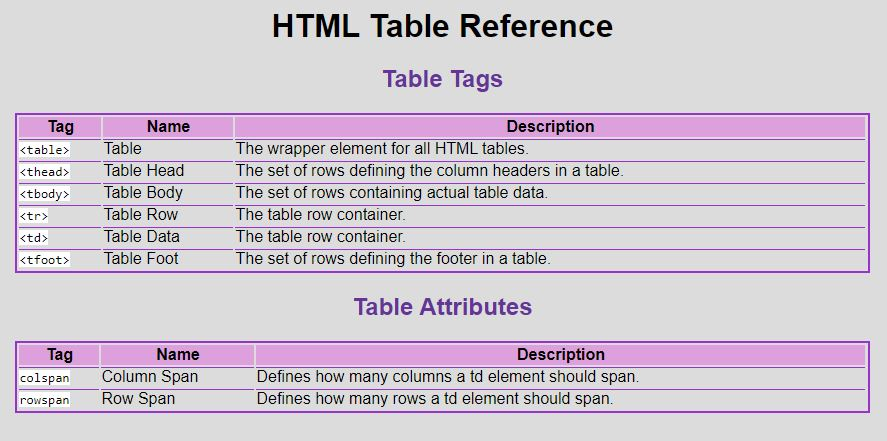

# Codecademy - Build Your Own Cheat Sheet

Your project should document at least one HTML or CSS topic. In our example project, we documented the tags and attributes used in HTML tables layouts, but you can choose any HTML or CSS topic that you’ve learned so far—the sky is the limit!

Possible topics could be:

- HTML Tables
- Other HTML tags
- CSS selectors and specificity
- Common CSS properties

If you choose to document HTML tags, open the hint to see how to include HTML tags as text in your code.

## Table of contents

- [Overview](#overview)
  - [The challenge](#the-challenge)
  - [Screenshot](#screenshot)
  - [Links](#links)
- [My process](#my-process)
  - [Built with](#built-with)
  - [What I learned](#what-i-learned)
  - [Continued development](#continued-development)
  - [Useful resources](#useful-resources)
- [Author](#author)
- [Acknowledgments](#acknowledgments)

## Overview

### The challenge

Your site uses HTML tables to display the documentation. Be sure to label the columns in your HTML.

In our example site, we used tables with columns for:

a) The tag or attribute name.
b) The actual formatted tag.
c) A description of what to use the tag for.
d) You can use these same columns or choose your own.

Your site should utilize a custom color scheme. You can use any of the named CSS colors.

Your site should use custom styles for any code such as HTML tags (like h1) or CSS properties or values (like font-family). Represent code using a monospace font family and a different background color.

### Screenshot



### Links

- [Solution Link](https://github.com/heraldofortuna/html-css-cheatsheet-starting)
- [Live Site Link](https://heraldofortuna.github.io/html-css-cheatsheet-starting/)

## My process

### Built with

- Semantic HTML5 markup
- CSS custom properties

### What I learned

```html
<thead>
  <tr>
    <th>Tag</th>
    <th>Name</th>
    <th>Description</th>
  </tr>
</thead>
<tbody>
  <tr>
    <td><span class="code">&lt;table&gt;</span></td>
    <td>Table</td>
    <td>The wrapper element for all HTML tables.</td>
  </tr>
</tbody>
...
```

```css
table {
  width: 95%;
  border: 2px solid var(--purple-color-3);
}

thead {
  background-color: var(--purple-color-2);
}

td {
  border-top: 1px solid var(--purple-color-3);
}

th,
td {
  height: 20px;
}

.code {
  background-color: var(--white-color);
  font-family: monospace;
}
```

## Author

- Codeacademy - [heraldofortuna](https://www.codecademy.com/profiles/heraldofortuna)
- Twitter - [@heraldofortuna](https://twitter.com/heraldofortuna)
